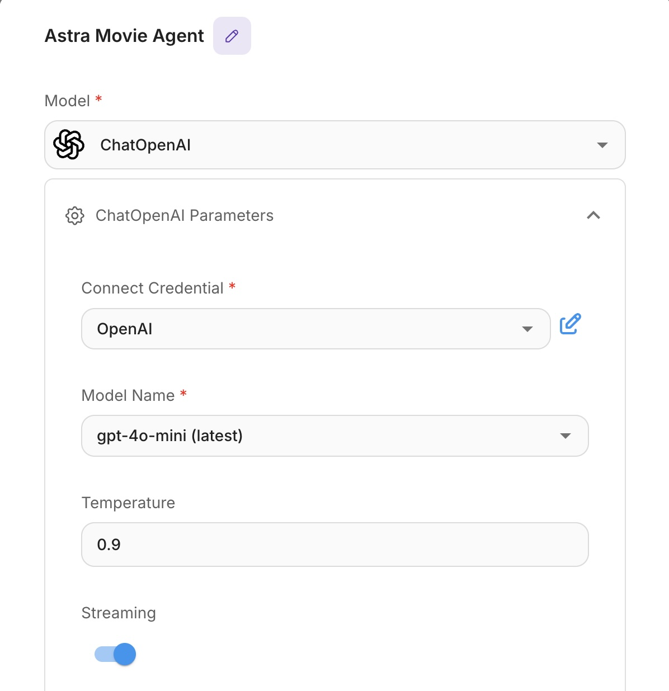

		# Movie Key App (Astra DB Edition)

This application is a next-generation movie and TV show browser designed to provide **true intersecting search capabilities**. It allows users to layer multiple criteria—such as Genre, Cast Member, and Streaming Provider—to drill down to exact results (e.g., "Show me Sci-Fi movies starring Tom Hanks that are available on Netflix").   The movie information and interaction is driven by [TMDB](https://tmdb.org)

Beyond traditional filters, this application utilizes **Vector Search** to understand the semantic meaning of your queries, enabling you to find titles based on themes, plot descriptions, or "vibe" rather than just keyword matching.

Working example at [The Intersect](https://theintersect.netlify.app)

## Core Features

*   **Intersecting Queries (The "Key" Concept)**: Stack filters dynamically. Every filter you add (e.g., "Action", "Keanu Reeves") behaves as an **AND** condition, narrowing your results instantly.
*   **Vector Search & AI**: Uses OpenAI embeddings stored in **DataStax Astra DB** to power semantic search. You can search for "movies about time travel mechanics" and get relevant results even if those words aren't in the title.
*   **Streaming Availability**: Integrated "Watch Provider" filtering to show only content available on your subscriptions (Netflix, Hulu, Prime, etc.).
*   **Similar Titles**: A "More Like This" recommendation engine that uses vector similarity to find finding movies with matching plots and themes.
*   **Unified Discovery**: Browse Movies and TV Shows in a single, unified grid.
*   **Integrated AI Chatbot**: A genAI chatbot trained on the Intersect database.

## Technology Stack

This project is built with a modern, serverless architecture:

*   **Frontend**: Vanilla JavaScript + [Vite](https://vitejs.dev/) (Fast, lightweight, no-framework overhead).
*   **Backend**: [Netlify Functions](https://docs.netlify.com/functions/overview/) (Node.js) serves as the API layer, keeping credentials secure and handling logic.
*   **Database**: [DataStax Astra DB](https://astra.datastax.com/) (Serverless Vector DB) stores movie metadata and vector embeddings.
*   **AI/Embeddings**: [OpenAI API](https://openai.com/) (`text-embedding-3-small`) converts text into vector data for search.
*   **Data Source**: Metadata provided by [The Movie Database (TMDB)](https://www.themoviedb.org/).
*   **AI Chatbot**: Uses [Flowise](https://flowiseai.com) to answer questions based on the database.

## Setup & Data Population

This application requires a populated database to function. The repository includes a subset of data suitable for use to populate the movie backend with popular movies.

### Prerequisites

*   Node.js (v18+)
*   Python 3 (for data loading scripts)
*   [Astra DB](https://astra.datastax.com) Account (Free tier works)
*   OpenAI API Key
*   [TMDB](https://tmdb.org) API Key (v4 Read Token)
*   [Netlify](https://netlify.com) Account

### 1. Installation

```bash
git clone <repository-url>
cd movie-key-app
npm install
```

### 2. Environment Variables

Create a `.env` file in the root directory:

```bash
cp .env.example .env
```

Fill in your credentials:
*   `ASTRA_DB_API_ENDPOINT`: Your API endpoint from Astra DB.
*   `ASTRA_DB_APPLICATION_TOKEN`: Your "AstraCS:..." token.
*   `OPENAI_API_KEY`: For generating embeddings.
*   `TMDB_READ_TOKEN`: For fetching fresh metadata.

### 3. Database Population

You have two options to populate the database:

#### Option A: Quick Start (Recommended)
We have provided a pre-processed dataset (`database_upload.json`) containing movies and TV shows with embeddings already generated.

1.  Ensure your `.env` file is set up with Astra DB credentials and OpenAI credentials

```
# Astra DB Configuration
ASTRA_DB_KEYSPACE=default_keyspace
ASTRA_DB_APPLICATION_TOKEN=
ASTRA_DB_API_ENDPOINT=
OPENAI_API_KEY=
```

2.  Run the loader script (this takes a couple of minutes)

    ```bash
    node bin/setup_data.js

3.  Unzip the autocomplete index:

    ```bash
    gunzip public/autocomplete.json.gz
    ```


### 3. Running Locally

The application requires the Netlify framework to work - it serves the serverless functions for the front end to use.  You can run it locally with `netlify dev` or push it to the web with `netlify deploy --prod`

```bash
netlify login
netlify sites:create (you need to pick a unique name for the site)
netlify dev
```

Open `http://localhost:8888` to browse the app.

### 4. Creating the Chat Agent using Flowise

Visit [Flowise](https://flowiseai.com/) and click "Get Started" to create an account if you don't already have one.

First, set up your credentials.
1. From the left hand navbar, click "Credentials"
2. For Astra
   * Get the credentials from the [Astra website](https://astra.datastax.com).  No credit card is needed for their free tier account.
   * You can get connection credentials by clicking "Connect" on the page for your database.
   * Enter the endpoint and token for your database in the Credentials dialog.
3. For OpenAI
   * Get the credentials from [OpenAI](https://openai.com)
   * You will need your OpenAI API key


Next, create the custom tool for the Astra search
1. Select "Tools" on the left hand navbar
2. Click "Create" to create a new tool
3. Configure the tool to match this image
   * Name: astra_movie_search
   * Tool Description: Use this tool to search The Intersect movie database. It contains 100,000 records. Input should be a search string like a movie title or actor name. This is the only source for movie data..
   * Input Schema: Add a string field named "query" with the following description: "The movie title or search terms to look up in the database."

Bring it all together
1. Click "Agentflows" to get started
3. You'll see a "Start" node - double click to make sure this has "Chat agent" selected
4. Add an Agent by clicking on the plus icon and selecting "Agent" at the top of the list
5. Configure the ChatOpenAI Model
   * Select ChatOpenAI for the model
   * Select your OpenAI credential for the dropdown
   * Your ChatOpenAI configuration should look like this:<br/>
   
6. Configure the Messages section to add a system message:
   * Open "Messages"
   * Select "System"
   * Include this text: 
   ```
   You are a movie expert assistant with access to a database of hundreds of thousands movies. When users ask about movies, actors, directors, or film information, use the astra_movie_search tool to find relevant information. Always search the database before answering questions about specific movies. Format your responses in a friendly, conversational way. If the search returns multiple movies, help the user understand the differences. Do not use any information outside of The Intersect to answer questions.  If there is no information in the intersect database say you don't know.
   ```
7.  Time to incorporate the tool you made.
   * Click "Add Tool"
   * Select your astra_movie_search tool

8.  Save it and set it up!
   * Click the save image in the upper right
   * Click the ```</>``` embed button
   * Select "Popup: React"
   * Copy the embed text 
   * Open your `index.html` file
   * **Option 1 (Simple)**: Replace the whole Chatbot section with your copied code.
   * **Option 2 (Interactive)**: If you want to have interaction with the page (recommended), just replace the `chatflowid` and `apiHost` values in the existing code, which will retain the logic to pop up a movie dialog if a movie is returned in the text.

9. Run it locally

```bash
netlify dev
```

10. Run it in production
 
```bash
netlify deploy --prod
```

## Deployment

This project is optimized for deployment on **Netlify**.

1.  Connect your repository to Netlify with `netlify login` and `netlify link`
2.  Add your Environment Variables in the Netlify Dashboard.
3.  Deploy to your local system with `netlify dev`
4.  Deploy to the web with `netlify deploy --prod`

---
*Built with ❤️ using DataStax Astra DB and OpenAI.*
